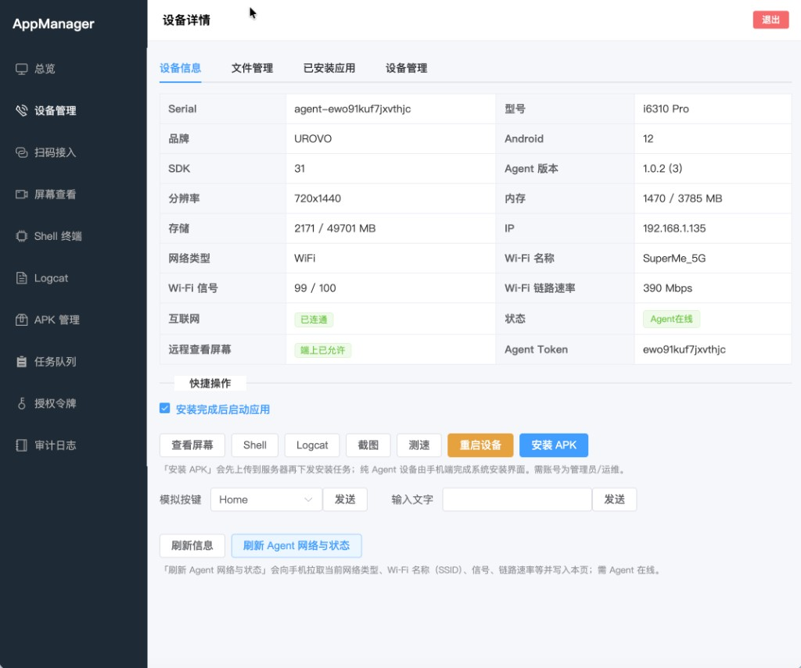
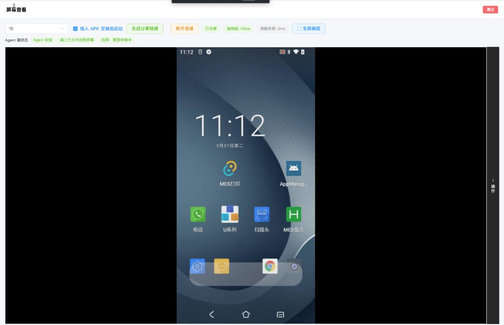

# App Manager

**App Manager** 是一套面向团队与运维的 **Android 设备集中管理** 与 **远程运维** 方案：浏览器里的控制台 + 设备端 Agent，可在内网自托管（默认 **SQLite**，无需单独装数据库）。

典型用途包括：**PDA / 工业手持终端管理**、**Android 远程桌面（远程画面查看）**、**远程屏幕分享**、批量安装 APK、Web Shell / Logcat、截图与录屏归档等。

---

## 关键词与定位

| 你可能在找 | 本仓库提供的能力 |
|------------|------------------|
| **PDA 管理** / **手持终端管理** | 设备分组、在线状态、已装应用、远程操作入口统一在 Web |
| **Android 远程桌面** / **远程画面** | 低延迟 **屏幕实时查看**、触控回传、全屏查看 |
| **远程桌面分享** / **屏幕分享** | 生成 **分享链接**，免登录按权限查看画面（适合协助、演示、监考场景） |
| **工业平板 / 扫码枪设备** | 支持 Agent 常连 + USB/网络 ADB 混合接入，统一台账 |
| **MDM 轻量替代** | 自托管、开放 API、审计日志；非系统级管控，侧重研发与运维协作 |

适合需要 **统一管理多台 PDA、测试机、展厅或门店设备** 的团队；数据留在自己服务器，可配合 `Makefile` 一键构建与打包发布。

---

## 你能用它做什么

| 能力 | 说明 |
|------|------|
| **设备与分组** | 登记设备、扫码/Token 接入、分组与别名；**PDA 设备** 与手机同一套管理界面 |
| **远程操控** | **Android 远程桌面式** 画面查看、触控、截图；ADB 常用能力（有串号时） |
| **终端与日志** | Web **Shell**、**Logcat** 流式查看（需 Agent 在线及权限） |
| **应用分发** | APK 上传、远程安装/卸载、进度追踪；支持 Intent 方式安装；可从设备拉取已装应用 APK |
| **USB 设备扫描（Bridge）** | 本地运行 `app-manager-bridge`，浏览器自动发现 USB 连接的 Android 设备并一键注册到服务器 |
| **摄像头直播** | 屏幕查看页实时查看设备**前置/后置摄像头**画面（WebRTC），支持浮窗与侧边两种布局，悬停显示分辨率/帧率/码率 |
| **录屏与录音** | 服务端录屏合成 MP4（需 ffmpeg）、**设备端录音** 并自动上传归档、在线播放 |
| **截图存档** | ADB 截图或 Agent 截图保存到服务器、在线查看、支持重命名 |
| **文件管理** | Agent 文件系统浏览、上传/下载文件、图片视频在线预览 |
| **自定义事件** | 配置 Android 广播监听（如 PDA 扫码）、事件上报、支持 MQTT 转发到外部系统 |
| **远程屏幕分享** | 生成 **分享链接**，免登录按权限查看画面（适合协助、演示、监考场景） |
| **出站集成（外部应用）** | 配置外部 HTTP 服务，事件触发时自动推送；支持静态 Header / Cookie、动态 Bearer Token（服务端自动获取/刷新）；接口调试、投递日志、阶段式流水线 |
| **数据栈** | 连接外部数据库（MySQL / SQLite 等），定义 Dataset（查询/静态/缓冲/事务）与开放数据接口；Buffer 支持 Webhook 入站与 HTTP 轮询写入 |
| **组态编辑器（SCADA）** | 可视化拖拽画布，绑定设备数据点实时刷新；内置图表、图片/装饰素材、图层管理，发布后可分享预览 |
| **Agent 菜单目录** | 在设备端 Agent 中配置自定义快捷入口，远程下发 Intent 或命令 |
| **开放 API** | API Key + 权限范围，便于接入 CI / 内部系统 |
| **审计** | 操作审计日志（管理员可见） |

---

## 界面预览

**设备详情** — Agent 在线、网络与存储、**PDA / 终端** 快捷入口（远程画面、Shell、截图、测速等）。



**屏幕查看（Android 远程桌面）** — 实时画面、端到端延迟、**分享链接** 与投屏状态。



---

## 环境要求

- **Go** 1.21+
- **Node.js** 18+（仅在你需要**重新构建**前端时）
- **adb**（Android 平台工具，在 `PATH` 中或配置里写绝对路径）
- **ffmpeg**（可选；需要服务端把录屏合成 **MP4** 时再装，否则可留空）

---

## 最快上手（SQLite，推荐）

**请在仓库根目录**（与 `web/`、`server/` 同级）执行下列命令，这样静态页面路径 `./web/dist` 才能正确加载。

也可使用 **`make all`** 构建前端并编译服务端二进制（见仓库根目录 [Makefile](Makefile)）。

### 1. 构建前端（若已有 `web/dist` 可跳过）

```bash
cd web && npm install && npm run build && cd ..
```

### 2. 编译并启动后端

```bash
go build -C server -o app-manager .
./app-manager server/config.sqlite.yaml
```

启动后浏览器访问：**http://127.0.0.1:8080**

### 3. 默认账号

首次启动若无用户，会自动创建管理员：

- 用户名：`admin`
- 密码：`admin123`

**务必登录后修改密码**；生产环境请修改 `jwt.secret` 或设置环境变量 `JWT_SECRET`。

---

## 配置说明

| 文件 | 用途 |
|------|------|
| [server/config.sqlite.yaml](server/config.sqlite.yaml) | **简化配置**：SQLite，复制即用 |
| [server/config.yaml](server/config.yaml) | 示例（含 MySQL 等），可按需参考 |

指定配置文件：

```bash
./app-manager /path/to/your-config.yaml
```

常用环境变量（覆盖配置中的同名项）：

- `JWT_SECRET` — JWT 密钥  
- `ADB_PATH` — adb 可执行文件路径  
- `FFMPEG_PATH` — ffmpeg 可执行文件路径  

### MQTT 转发（可选）

自定义事件支持转发到 MQTT broker，在配置文件中启用：

```yaml
mqtt:
  enabled: true
  broker: tcp://localhost:1883
  username: ""
  password: ""
  client_id: app-manager
  qos: 1
```

在「自定义事件配置」页面可为事件分组或单个事件定义配置 MQTT 主题，事件上报时自动转发。

---

## 使用 MySQL（可选）

将 `database` 改为例如：

```yaml
database:
  type: mysql
  dsn: "user:pass@tcp(127.0.0.1:3306)/app_manager?charset=utf8mb4&parseTime=True&loc=Local"
```

---

## Android Agent

设备端（**PDA、手机、工业平板** 等）需安装配套 **Agent**，配置服务器地址后与控制台保持 WebSocket 长连接，即可使用 **远程画面、Shell、日志** 等能力。

仓库内可用 Gradle 或 Makefile 编译安装，例如：

```bash
make install-agent
# 或
cd agent && ./gradlew :app:installDebug
```

亦可使用脚本 `./scripts/sync-agent-apk.sh`（需本机 Android SDK / Gradle；环境变量可参考 `scripts/sync-agent-apk.env.example`）。

---

## 本地开发前端（可选）

后端仍按上文在仓库根目录启动；前端单独调试时：

```bash
cd web && npm install && npm run dev
```

Vite 默认把 `/api`、`/ws` 代理到 `http://127.0.0.1:8080`，如需改端口可设置环境变量 `VITE_PROXY_TARGET`。

---

## 仓库结构（简要）

```
server/          Go 服务（API、WebSocket、任务队列）
web/             Vue 3 控制台
scada-editor/    组态编辑器（React 独立子应用，由 Go 服务托管）
agent/           Android Agent 工程
scripts/         辅助脚本（如 APK 同步）
docs/            文档与界面截图（README 引用）
Makefile         构建 server / web / agent 与 release 打包
```

---

## App Manager Bridge（本地 USB 扫描）

`bridge/` 是一个轻量本地代理程序，运行在管理员电脑上，通过 WebSocket 向浏览器推送本机 USB 连接的 Android 设备列表，并支持一键注册到 app-manager 服务器。

### 使用方式

```bash
# 编译
cd bridge && go build -o app-manager-bridge .

# 运行（需本机已安装 adb 并在 PATH 中）
./app-manager-bridge
# 监听 ws://127.0.0.1:17175
```

浏览器打开 app-manager 控制台 → 设备列表页 → 点击「USB 扫描」，即可自动发现并注册 USB 设备。

> Bridge 仅监听本地回环地址 `127.0.0.1`，不对外暴露。

---

## 许可证与贡献

欢迎 Issue / PR：优化文档（如 **PDA 管理**、**远程桌面分享** 等场景的说明）、修复问题、分享部署经验。

若在生产环境部署，请务必将默认密码、`jwt.secret` 与数据库连接信息替换为安全值。
